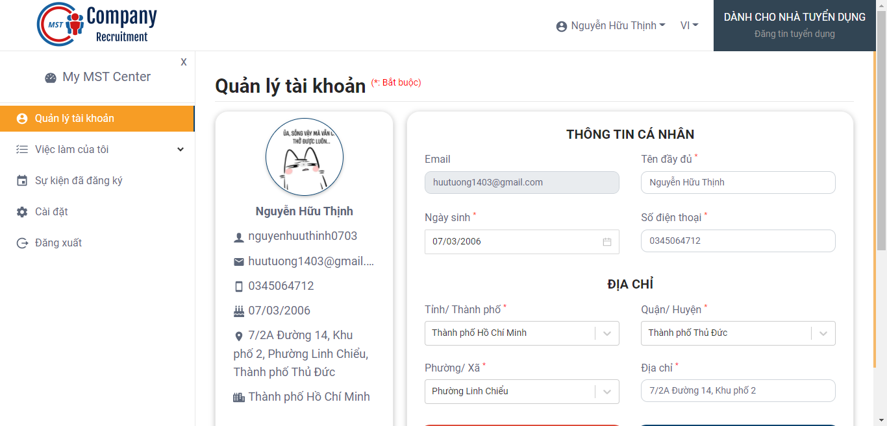
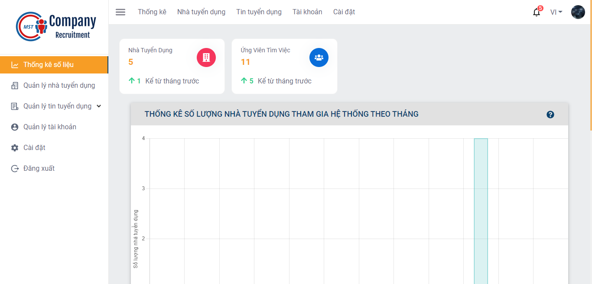
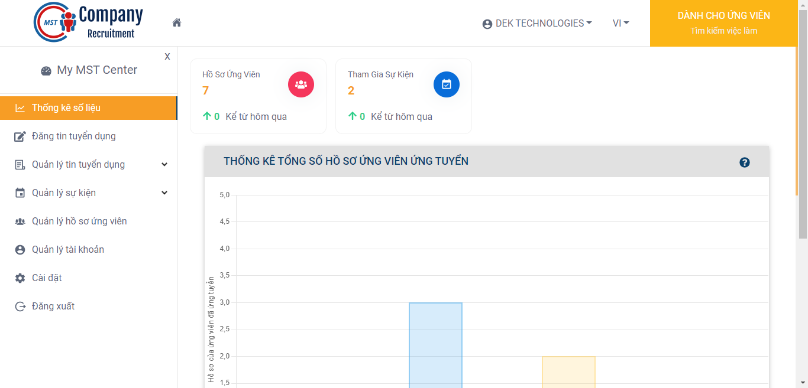
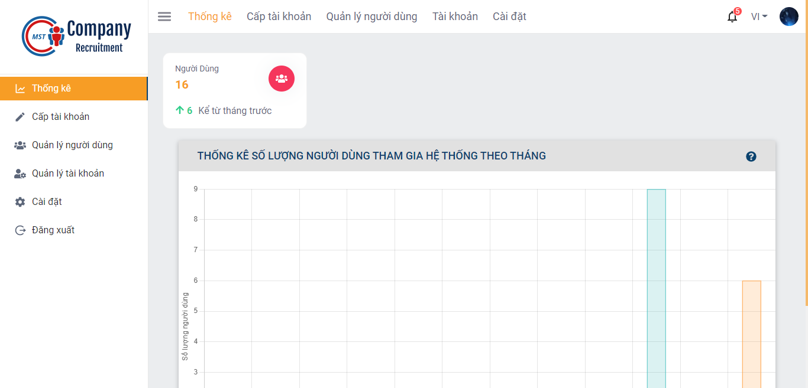
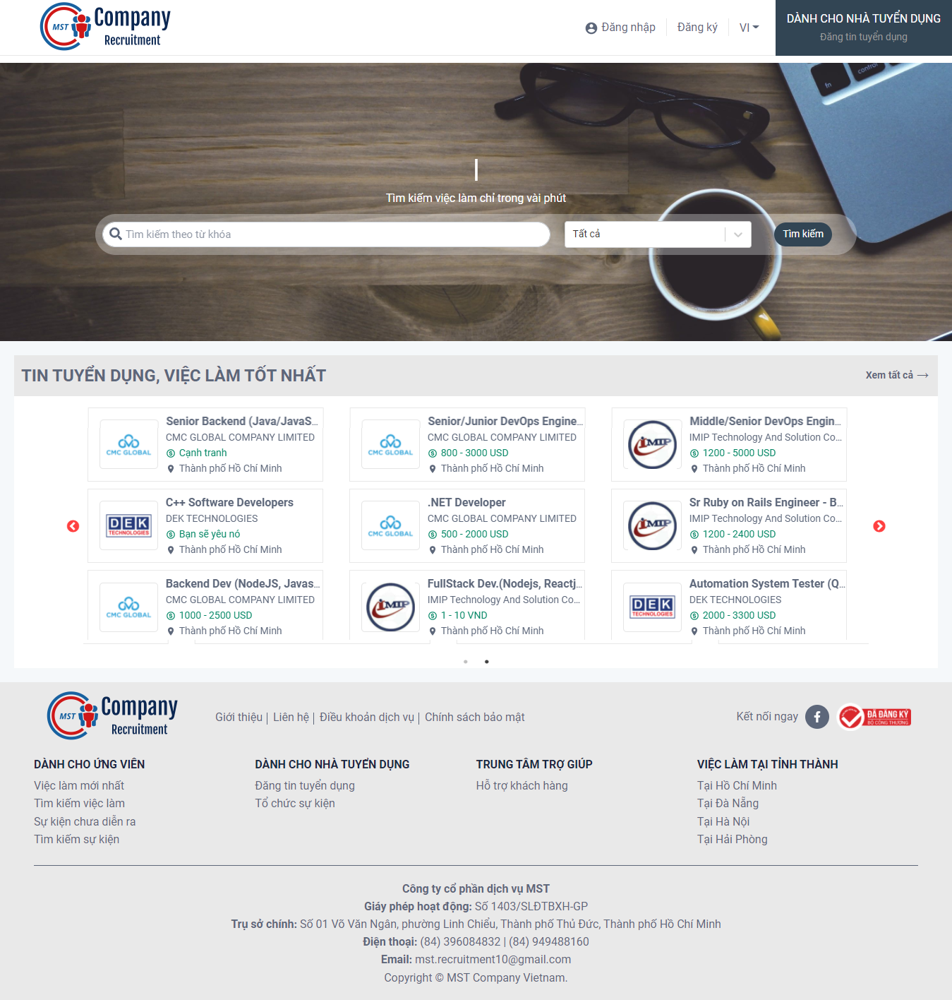
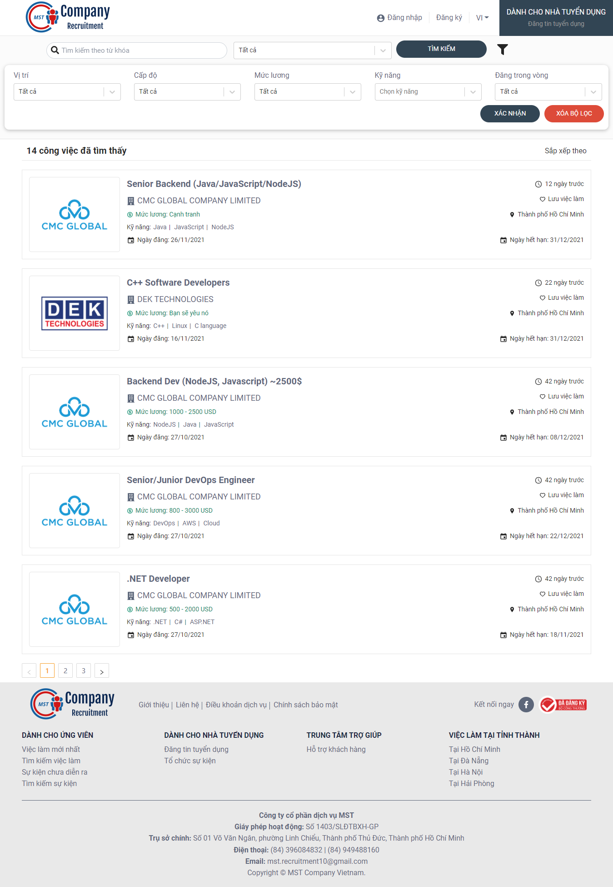
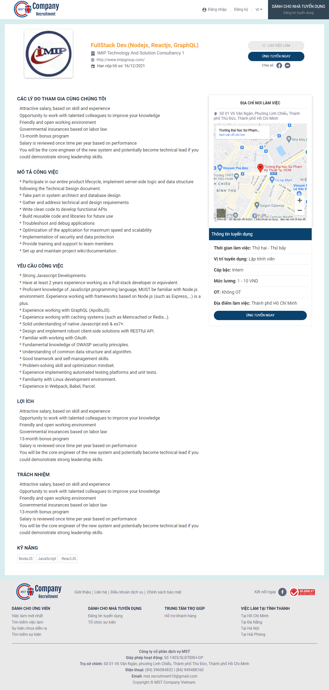
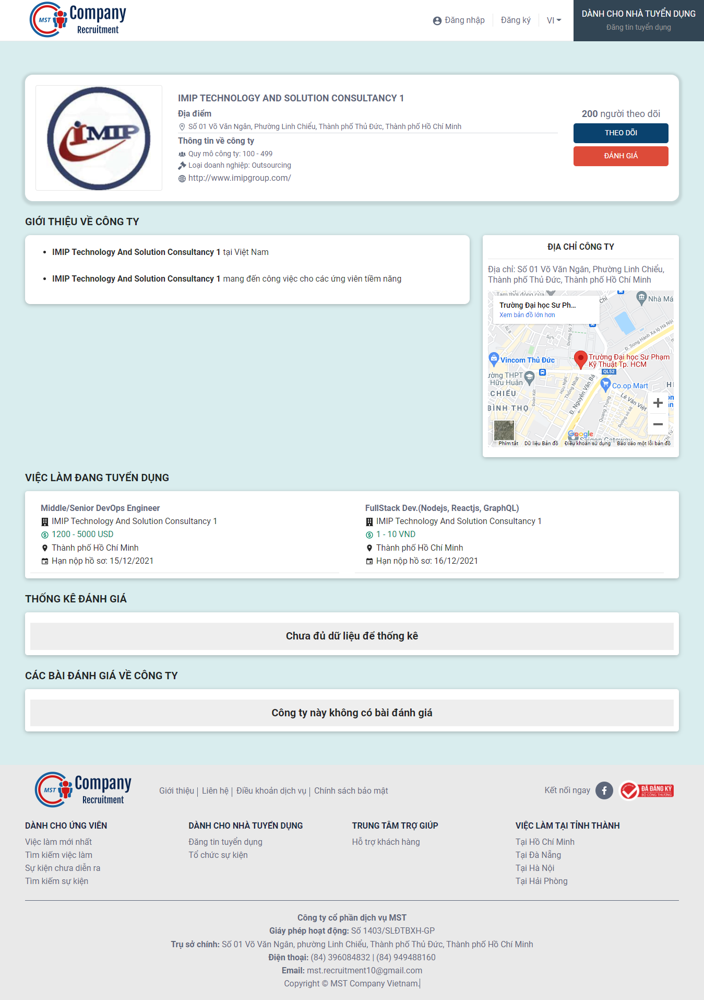

# Dự án xây dựng nền tảng hỗ trợ doanh nghiệp ngành CNTT tuyển dụng

## Các công nghệ đã sử dụng trong dự án
 - Frontend: [ReactJS](https://reactjs.org)
 - Backend: [NodeJS](https://nodejs.org/en) + [ExpressJS](https://expressjs.com)
 - Database: [MongoDB](https://www.mongodb.com)
 - Deploy FE: [Firebase](https://firebase.google.com)
 - Deploy BE: [Heroku](https://www.heroku.com)

## Một số hình ảnh của dự án
|                                     |                                     |                                     |                                   |
|                    :---:            |                :---:                |                   :---:             |                :---:              |
|    |    |    |  |
|    |    |    |  |

## Các địa chỉ Website của Frontend đã deploy lên Firebase
 - Website của JobSeeker, Employer: [https://mst-recruit.web.app](https://mst-recruit.web.app)
 - Website của System Manager: [https://system-mst-recruit.web.app](https://system-mst-recruit.web.app)
 - Website cho System Admin: [https://admin-mst-recruit.web.app](https://admin-mst-recruit.web.app)

## Cấu trúc thư mục
 - [Repository Document](https://github.com/HuuTuong1403/RecruitmentProject/tree/main/Document): Các tài liệu của dự án
 - Frontend:
   - [Repository Client](https://github.com/HuuTuong1403/RecruitmentProject/tree/main/client-side/client): Mã nguồn của Khách hàng (JobSeeker, Employer)
   - [Repository System Manager](https://github.com/HuuTuong1403/RecruitmentProject/tree/main/client-side/system-manager-recruitment): Mã nguồn của Quản lý hệ thống (System Manager)
   - [Repository System Admin](https://github.com/HuuTuong1403/RecruitmentProject/tree/main/client-side/admin-recruitment): Mã nguồn của Quản trị hệ thống (System Admin)
 - Backend:
   - [Repository Server](https://github.com/HuuTuong1403/RecruitmentProject/tree/main/server): Mã nguồn của Backend

## Video demo của dự án

## Các chức năng chính của dự án
 | Job Seeker                         | Employer                                 | System Manager               | System Admin                        |
 | ---------------------------------- | -------------------------------------    | ---------------------------- | ------------                        |
 | ✅ Tìm kiếm công việc phù hợp      | ✅ Đăng tin tuyển dụng                  | ✅ Xem số liệu thống kê     | ✅ Xem số liệu thống kê            |
 | ✅ Tìm kiếm sự kiện trên hệ thống  | ✅ Tổ chức sự kiện                      | ✅ Phê duyệt nhà tuyển dụng | ✅ Cấp tài khoản quản lý hệ thống  |
 | ✅ Ứng tuyển công viêc             | ✅ Quản lý tài khoản                    | ✅ Quản lý tin tuyển dụng   | ✅ Cấp tài khoản quản trị hệ thống |
 | ✅ Tham gia sự kiện                | ✅ Quản lý tin tuyển dụng               | ✅ Tạo dịch vụ              | ⬜️ Quản lý người dùng              |
 | ✅ Đánh giá doanh nghiệp           | ✅ Quản lý sự kiện                      | ✅ Quản lý dịch vụ          |                                     |
 | ✅ Lưu việc làm                    | ✅ Quản lý hồ sơ ứng viên               | ✅ Tạo gói dịch vụ          |                                     |
 | ✅ Quản lý tài khoản               | ✅ Quản lý thành viên tham gia sự kiện  | ✅ Quản lý gói dịch vụ      |                                     |
 | ⬜️ Tạo CV trực tuyến               | ✅ Xem số liệu thống kê                 |                              |                                     |
 | ⬜️ Tham gia Entry Test             | ⬜️ Tạo Entry Test                       |                              |                                     |
 |                                     | ⬜️ Quản lý Entry Test                   |                              |                                     |
 |                                     | ⬜️ Đăng ký gói dịch vụ                  |                              |                                     |

## Thông tin liên hệ
 - GVHD: Thầy **Nguyễn Thanh Phước**
 - Thành viên:
   - **Nguyễn Hữu Tường**
     - [Github](https://github.com/HuuTuong1403)
     - [Facebook](https://www.facebook.com/huutuong1403)
   - **Đặng Nguyễn Hoài Thư**
     - [Github](https://github.com/HoaiThu0801)
     - [Facebook](https://www.facebook.com/di.di.56232)

